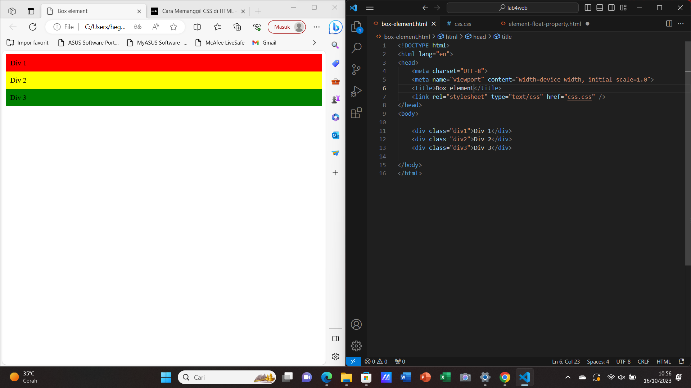

## NAMA : Mohamad Hegar Sukmana Wibowo
## NIM : 312210332
## KELAS : TI. 22. A3
## Mata Kuliah : Pemograman Web

### Membuat HTML lab4_box.html dengan CSS pada head.

* CSS Float Property

### Input

```python
<!DOCTYPE html>
<html lang="en">
<head>
    <meta charset="UTF-8">
    <meta name="viewport" content="width=device-width, initial-scale=1.0">
    <title>Box Element</title>
    <link rel="stylesheet" type="text/css" href="css.css" />
</head>
<body>
    <header>
        <h1>Box Element</h1>
    </header>
    
    <div class="div1">Div 1</div>
    <div class="div2">Div 2</div>
    <div class="div3">Div 3</div>
    <div class="div4">Div 4</div>

</body>
</html>
```
### Output
